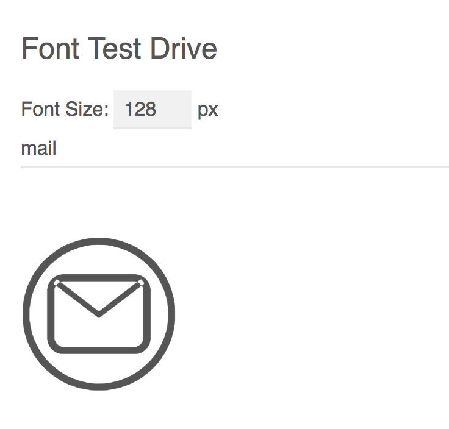
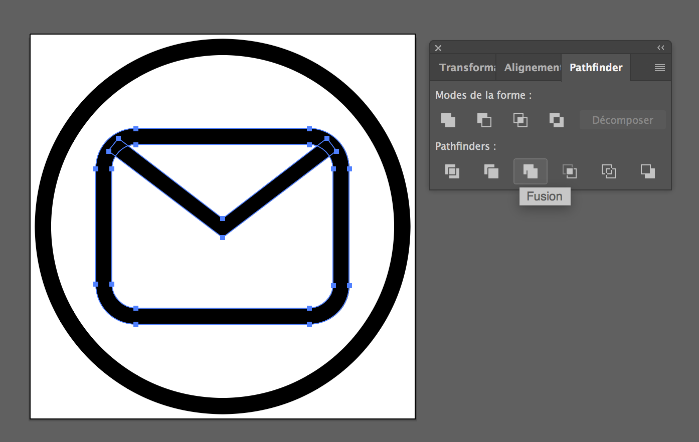

Avec l'arrivée des webfonts dans les navigateurs, une nouvelle possibilité s'est offerte pour afficher des graphiques vectoriels : **les fontes d'icônes**.

En effet, une image vectorielle peut être enregistrée sous forme de **glyphe** dans une fonte. Au lieu de charger les images vectorielles au format SVG (ou transformées en images bitmap PNG), la fonte présente plusieurs avantages:

- Une fonte peut contenir une grande quantité d'images différentes (chaque image étant un caractère), qui seront chargées en une seule fois.
- Une fonte bénéficie de tous les **effets visuels du CSS**, comme "<span style='color:tomato;'>color</span>" ou "<span style='text-shadow:1px 1px 5px cyan;'>text-shadow</span>" (ces effets ne sont pas aussi facilement appliquables pour des fichiers SVG).

Pour cette raison, une grande quantité de fontes d'icônes "génériques" ont fait leur apparition, offrant des librairies d'icônes prêtes à l'emploi.

## Produire une fonte d'icône personnalisée

Vous souhaitez utiliser vos propres icônes pour en faire une fonte?

Il existe pour cela un excellent utilitaire en ligne: [Icomoon](https://icomoon.io/).

### Création de fonte avec Icomoon

#### Importer la fonte dans Icomoon


Le processus pour créer votre fonte est le suivant:

- Créez vos icônes dans un logiciel comme Inkscape, Sketch ou Illustrator, et sauvez-les en format SVG.
- Veillez à ce qu'elles aient les mêmes dimensions.
- Dans Icomoon, allez dans IcomoonApp.
- Cliquez Importer, sélectionnez vos SVG.

####  Options de la fonte

Un fois les icônes sélectionnées, cliquez "Générate Font".

Lors de la création de la fonte, Icomoon vous propose deux méthodes pour appliquer les icônes:

* **Méthode Unicode** (U+) : vous définissez un champ Unicode correspondant à ce glyphe. Cela peut être une lettre de l'alphabet, l'un des milliers de champs unicode disponible, voire un champ "emoji".
* **Méthode Ligature** : vous tirez parti des ligatures, et définissez une suite de caractères qui correspondra, dans cette fonte, à une ligature. Par exemple, la suite de caractères "menu" peut être remplacée par le glyphe représentant le menu, le mot "twitter" peut être remplacée par l'icône du petit oiseau, etc.

Un avantage de la méthode ligature est que, en cas de non-chargement de la fonte, le texte s'affiche. Ainsi, l'utilisation de l'interface ne sera pas entravée.


#### Problèmes possibles

Selon la manière dont vous avez créé vos fichiers SVG, il est possible que vous soyez confronté aux problèmes suivants:

##### Strokes and outlines

Pour être transformé en gylphe, votre fichier SVG doit être composé de **surfaces remplies** (*outlines* ou *fills*), et non de **chemins** (*strokes*). Si votre image contient des *strokes*, vous verrez cet avertissement:


Pour faire cela, voici l'opération à faire dans Adobe Illustrator:

* Sélectionner le chemin.
* Choisissez *Objet > Décomposer* (ou *Object > Expand*).


##### Glyphes multicouleurs 

Si vous avez utilisé différentes couleurs dans votre fichier SVG, Icomoon vous en informe: "Multicolor glyphs take more than one character code...". Cela va empêcher d'utiliser ce glyphe pour une ligature.


Pour résoudre ce problème, veillez à ce que la couleur de fond de votre symbole soit du noir à 100% (#000000 dans le code source du SVG). Sinon, Icomoon considère que vous souhaitez créer un glyphe "multi-color", qui ne fonctionne pas comme ligature.

##### Formes qui se superposent

Si votre image comporte des formes superposées, votre fonte pourra présenter des problèmes, comme ici:



Pour éviter cela, **fusionnez** les formes qui se superposent. Dans Illustrator, vous pourrez utiliser l'outil *Pathfinder*, avec l'opération "Fusion"



#### Appliquer la fonte sur votre site

Une fois que vous avez généré la fonte, Icomoon produit un ZIP contenant plusieurs fichiers:

* Un dossier "fonts" comprenant vos fontes, en version WOFF, EOT, SVG, et TTF.
* Un fichier demo.html qui vous présente les glyphes de votre fonte.
* Un fichier style.css qui contient des styles CSS à utiliser pour intégrer la fonte dans votre code.

Pour utiliser la fonte dans votre projet, voici les étapes à suivre

1. Placer les fichiers au bon endroit.
2. Charger la fonte dans votre CSS.
3. Appliquer la fonte dans votre CSS.

Pour **placer les fichiers au bon endroit**, copiez les fichiers webfont (woff, svg, ttf etc) dans la structure de dossiers de votre site. Vous aurez peut-être un dossier nommé `fonts`, dans lequel vous pourrez les glisser.

Pour **charger la fonte** dans votre CSS, vous pourrez récuper la partie `@font-face` du style.css fourni par Icomoon. Vous devrez peut-être adapter le chemin des fontes, en fonction de la structure des dossiers de votre site.

Voici à quoi ressemble le code CSS fourni par Icomoon:

```css
@font-face {
  font-family: 'ma-super-fonte';
  src:  url('fonts/ma-super-fonte.eot?5pdit4');
  src:  url('fonts/ma-super-fonte.eot?5pdit4#iefix') format('embedded-opentype'),
    url('fonts/ma-super-fonte.ttf?5pdit4') format('truetype'),
    url('fonts/ma-super-fonte.woff?5pdit4') format('woff'),
    url('fonts/ma-super-fonte.svg?5pdit4#cfv-icons') format('svg');
  font-weight: normal;
  font-style: normal;
}
```

C'est la syntaxe @font-face classique, pour plus de détails voir le chapitre [Webfonts](/typo/webfonts/).

Finalement, pour **appliquer la fonte** dans votre CSS, vous pouvez également utiliser le code d'exemple fourni dans style.css. Voici à quoi il ressemblera:

```css
[class^="icon-"], [class*=" icon-"] {
  /* use !important to prevent issues with browser extensions that change fonts */
  font-family: 'ma-super-fonte' !important;
  speak: none;
  font-style: normal;
  font-weight: normal;
  font-variant: normal;
  text-transform: none;
  line-height: 1;
  
  /* Enable Ligatures ================ */
  letter-spacing: 0;
  -webkit-font-feature-settings: "liga";
  -moz-font-feature-settings: "liga=1";
  -moz-font-feature-settings: "liga";
  -ms-font-feature-settings: "liga" 1;
  font-feature-settings: "liga";
  -webkit-font-variant-ligatures: discretionary-ligatures;
  font-variant-ligatures: discretionary-ligatures;

  /* Better Font Rendering =========== */
  -webkit-font-smoothing: antialiased;
  -moz-osx-font-smoothing: grayscale;
}
```

Vous pouvez conserver ce code tel quel, mais devrez peut-être changer **le sélecteur**, afin de cibler l'élément précis sur lequel vous voulez appliquer la fonte.

Si votre fonte doit agir sur un menu, voici à quoi votre sélecteur pourrait ressembler:

```
.primary .menu-item a {
/* code icomoon */
}
```

Enfin, vous devrez probablement ajouter une `font-size` afin de préciser la taille de votre icône.